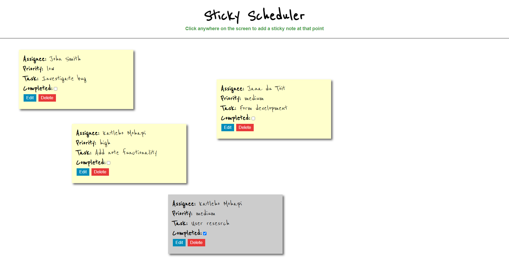
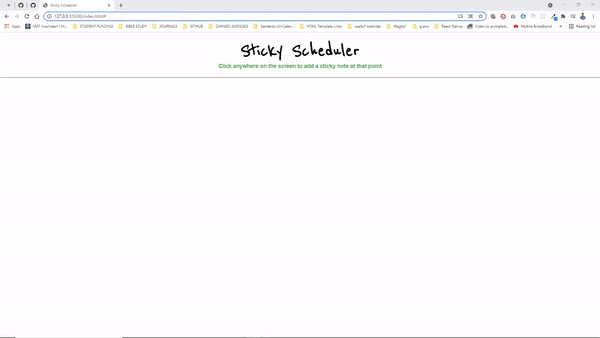

## JavaScript Task Management App

This is a sticky note inspired task management app that a software manager can use in the management of their team.  
The live application can be viwed [here](https://frosty-goldberg-8223dd.netlify.app/)

#### Please Note: 
`localStorage` was used to store the sticky note data on the browser so that the note will remain on page refresh. The assumption is that the assignee data will be coming from a backend database, that is why a static list (select form) was used for this demonstration.

### The app allows you to do the following:

1. Click anywhere on the screen to add a sticky note at that point

2. Allow the user to enter/edit:
    - Assignee
    - Priority (static list of priorities)
    - Task (standard text)
    - Complete state

3. Complete cards are de-emphasised 

4. Upated and delete sticky note
